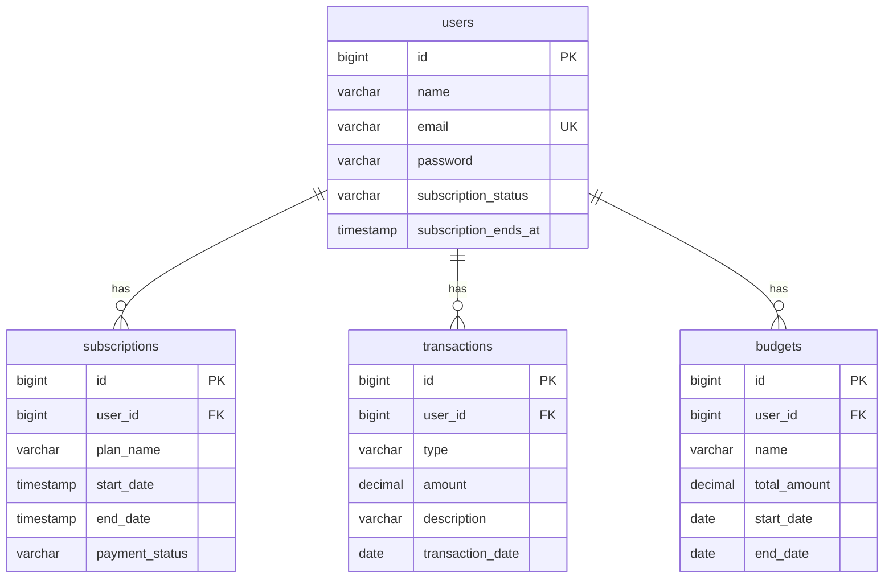

Tentu, kita sekarang masuk ke tahap implementasi database. Ini adalah langkah di mana kita mengubah desain ERD menjadi kode nyata menggunakan Laravel.

Saya akan mengambil *library prompt* `Prompt_Generate_Migration_Laravel.md` dan mengubahnya menjadi **Master Prompt** yang bisa Anda gunakan berulang kali untuk membuat setiap file migration yang dibutuhkan oleh proyek **amf-fintech**.

Saya telah menyertakan contoh pengisian yang spesifik untuk salah satu tabel `amf-fintech` (`transactions`) agar Anda lebih mudah menggunakannya untuk tabel-tabel lain.

-----

### **Master Prompt (Siap Digunakan untuk Membuat File Migration Laravel)**

**Petunjuk:** Pertama, aktifkan persona `Persona_Lead_Developer_LIQ.md`. Setelah AI mengonfirmasi perannya, gunakan prompt di bawah ini. Anda hanya perlu mengganti `[NAMA_TABEL]` dan mengisi spesifikasi kolom sesuai tabel yang ingin Anda buat.

-----

# Konteks:

Kita akan membuat file migration untuk mendefinisikan skema tabel secara konkret di dalam proyek Laravel **amf-fintech**.

Sebagai acuan, kita akan menggunakan desain dari ERD yang telah dibuat.

**(Opsional) ERD untuk amf-fintech:**



-----

### Tugas Anda:

Berperan sebagai seorang Lead Developer LIQ yang sangat ahli dengan Laravel Schema Builder.

Tugas Anda adalah menulis kode PHP yang lengkap untuk sebuah file migration Laravel yang akan membuat tabel bernama **`[NAMA_TABEL]`**.

##### Berikut adalah spesifikasi detail untuk kolom-kolom dan relasi tabel tersebut. Mohon ikuti dengan sangat teliti:

*(Salin format di bawah ini dan isi sesuai kebutuhan tabel Anda. Hapus contoh jika tidak diperlukan)*

```
--- CONTOH PENGISIAN UNTUK TABEL 'transactions' ---
[
- id: (Primary Key)
- user_id: foreignId, constrained('users')->onDelete('cascade')
- type: enum(['income', 'expense'])
- amount: decimal(15, 2), unsigned()
- description: string(255)
- transaction_date: date()
- timestamps: (Gunakan ->timestamps())
]
```

-----

### Catatan

Berikan kode PHP yang lengkap dan siap pakai untuk sebuah file migration.

  * Pastikan untuk menyertakan `namespace`, `use Schema`, `class`, serta metode `up()` dan `down()` yang sudah terisi dengan benar.
  * Metode `down()` harus berisi `Schema::dropIfExists('[NAMA_TABEL]');`.
  * Sajikan jawaban Anda dalam satu blok kode PHP yang rapi, seolah-olah saya bisa langsung menyalin dan menyimpannya ke dalam file `database/migrations/YYYY_MM_DD_HHMMSS_create_[nama_tabel]_table.php`.